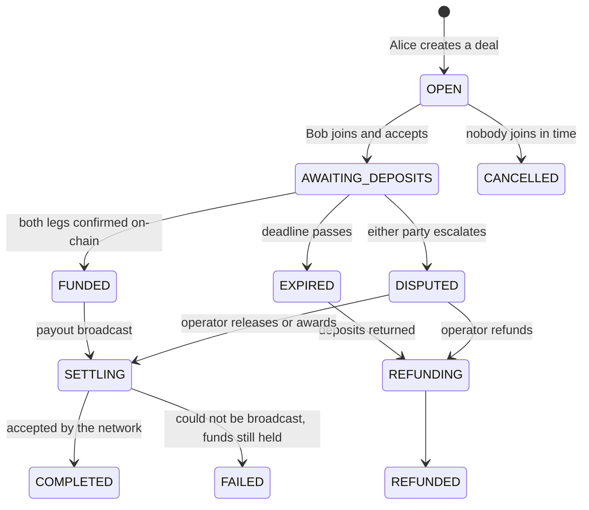

# ton-guarantor-bot

A self-hosted **escrow bot for TON deals on Telegram**. Two people agree to
swap something — TON for an NFT, jettons for a Telegram username, a token for a
game account — and this bot holds both sides until both have actually arrived
on-chain, then swaps them in a single transaction and takes your commission.

Run it for your own trades, or run it as a service for a community and charge
for it. Everything is configurable; nothing phones home.

```
Alice: 10 TON  ─┐                    ┌─►  Bob   receives 9.9 TON
                ├─►  escrow wallet ──┤
Bob:   one NFT ─┘   (verifies both)  └─►  Alice receives the NFT
                                          operator keeps 0.1 TON
```

---

## What it actually verifies

The point of a guarantor is that nobody has to trust the counterparty. So the
bot never asks a party to *claim* they sent something:

| Leg | How the deposit is proven |
|---|---|
| **TON** | An incoming transfer to the escrow whose text comment matches the deal's memo, for at least the agreed amount. |
| **NFT** (TEP-62) | An `ownership_assigned` message **sent by the NFT item contract named in the deal**. No other contract can forge it. |
| **Jetton** (TEP-74) | A `transfer_notification` **sent by the escrow's own jetton wallet** for the master named in the deal. |
| **Off-chain** | Nothing — the chain cannot see it. The counterparty presses *I received it*, and either party can escalate to the operator. Can be disabled with `ALLOW_OFFCHAIN_ASSETS=false`. |

Both sides are paid out in **one external message**, so a swap cannot half-happen.

## Features

- **Automatic settlement.** No button says "I sent it" — the watcher reads the
  chain and settles the moment both legs are confirmed.
- **Automatic refunds.** If the deposit deadline passes, everything already in
  escrow goes back to the exact wallet it came from. Payout addresses are
  derived from the deposits, so nobody can mistype an address.
- **Crash-safe payouts.** The wallet `seqno` and expiry of every signed message
  are persisted *before* broadcast; after a restart the bot asks the chain what
  happened instead of guessing, and rebuilds only messages that provably
  expired unapplied.
- **Disputes and arbitration.** Either party can freeze a deal; the operator can
  settle it, refund it, award everything to one side, or send funds out by hand.
- **Configurable fees.** Percentage with a floor, charged to the receiver, the
  sender, or split — see [Fees](#fees).
- **Two languages** (English and Russian) with a `/lang` switch, and a
  one-file-per-locale layout for adding more.
- **Testnet-first.** `TON_NETWORK=testnet` is the default; rehearse before you
  hold anyone's money.
- SQLite storage, Docker image, `doctor` pre-flight check, 97 tests.

## Quick start

```bash
git clone https://github.com/cprite/ton-guarantor-bot
cd ton-guarantor-bot
python -m venv .venv && source .venv/bin/activate
pip install -e .

cp .env.example .env
```

1. **Create the bot.** Talk to [@BotFather](https://t.me/BotFather), take the
   token, put it in `BOT_TOKEN`.
2. **Set yourself as operator.** Ask [@userinfobot](https://t.me/userinfobot)
   for your numeric ID and put it in `ADMIN_IDS`. The bot refuses to start
   without one — a disputed deal needs somebody who can resolve it.
3. **Create the escrow wallet:**
   ```bash
   guarantor new-wallet
   ```
   Copy the printed `ESCROW_MNEMONIC=` line into `.env`. This phrase controls
   every deposit the bot will ever hold. It is printed once and stored nowhere.
4. **Fund it.** Send the printed address a little TON — on testnet, from
   [@testgiver_ton_bot](https://t.me/testgiver_ton_bot). The escrow pays the
   forwarding gas for NFTs and jettons out of its own balance.
5. **Check everything before it holds money:**
   ```bash
   guarantor doctor
   ```
6. **Run it:**
   ```bash
   guarantor run
   ```

Then open your bot, press *Create a deal*, and rehearse a full swap on testnet
with a second Telegram account.

### Docker

```bash
cp .env.example .env   # fill it in as above
docker compose up -d --build
```

The database lives on a named volume, so deals survive a rebuild. The bot polls
Telegram and the TON API — it needs no inbound ports and no domain.

## How a deal runs



1. Alice picks what she gives and what she wants, and gets a code plus a
   `t.me/yourbot?start=deal_XXXXXXXX` link.
2. Bob opens the link, sees the mirrored terms and the fee, and accepts.
3. Both get exact instructions: address, amount, and a **deposit comment unique
   to their side** — plus a `ton://` link that pre-fills all three.
4. The watcher credits each deposit as it lands and tells both parties.
5. When both are in, the escrow swaps them and takes the fee.

## Fees

The commission is always in TON. `FEE_PERCENT` with a `FEE_MIN_TON` floor
applies to the TON leg of a deal:

| `FEE_PAYER` | Alice sends | Bob receives |
|---|---|---|
| `receiver` (default) | 10 TON | 9.9 TON |
| `sender` | 10.1 TON | 10 TON |
| `split` | 10.05 TON | 9.95 TON |

A deal with **no TON leg** (an NFT for an NFT) has nothing to deduct from.
`FEE_NO_TON_LEG=skip` makes those free; `require_deposit` asks each side for
`FEE_FLAT_TON / 2` as a separate small transfer. Set `FEE_WALLET` to sweep
collected fees to a cold wallet after every deal, or leave it empty to let them
accumulate in the escrow.

A deal whose fee would swallow the TON leg is refused at creation, not at payout.

## Operator commands

Available only to the IDs in `ADMIN_IDS`:

| Command | What it does |
|---|---|
| `/stats` | Escrow balance and deal counts by status |
| `/inspect <code>` | Full JSON state of one deal |
| `/release <code>` | Settle a deal normally |
| `/award <code> <A\|B>` | Give everything in escrow to one party |
| `/refundeal <code>` | Return every deposit to where it came from |
| `/payout <address> <amount>` | Send TON out of escrow by hand |

`/payout` is the escape hatch for the one thing the bot cannot resolve on its
own: a transfer that matched no deal. You are told about those as they happen,
with the sender's address, so you can return them.

## Configuration

Every option is documented in [`.env.example`](.env.example). The ones worth a
second look:

- `TON_API_KEY` — get one from [toncenter](https://toncenter.com/api) or
  [tonconsole](https://tonconsole.com). The public endpoints rate-limit hard
  enough that deposits get noticed late.
- `ESCROW_MIN_RESERVE_TON` — payouts are refused rather than half-completed
  when the balance would fall below this. Forwarding an NFT or a jetton costs
  the escrow real gas.
- `DEPOSIT_TIMEOUT_SECONDS` — how long both parties have to fund an accepted
  deal before it is unwound.
- `ESCROW_WALLET_VERSION` — `v4r2` carries 4 messages per transaction, which is
  enough for any deal this bot builds. `v5r1` carries 255.

## Security model

**Read this before running it on mainnet.**

- **The escrow is a custodial hot wallet.** Deposits sit under a key your
  process can sign with. Anyone who gets `ESCROW_MNEMONIC` — from your `.env`,
  your shell history, a backup, a compromised host — takes every deposit the
  bot is holding. Keep balances small and settlement fast. A non-custodial
  version needs an on-chain escrow contract; this is not that, and does not
  pretend to be.
- **Off-chain legs are trust, not escrow.** The bot cannot verify a Steam key.
  Those deals rest on the counterparty confirming and on your arbitration.
- **Authorisation never comes from a message.** Callback payloads carry an
  action and a deal code, never a user ID; who you are is taken from the
  Telegram update and checked against the stored deal.
- **Deal codes are unguessable** — 8 characters from a 32-symbol alphabet,
  drawn from `secrets`.
- **Deposits are credited exactly once**, keyed by logical time and transaction
  hash, so a re-poll or a restart cannot double-credit.
- Run it as its own user, keep the database on a volume you back up, and
  rehearse the whole flow on testnet first.

Found a vulnerability? See [SECURITY.md](SECURITY.md).

## Development

```bash
pip install -e ".[dev]"
make test        # pytest
make lint        # ruff
make typecheck   # mypy
```

The tests run the real state machine, the real fee arithmetic and a real SQLite
database; only the two network boundaries — the TON API and the wallet's
signing — are faked. Message-body parsing is tested against cells built with
`pytoniq-core`, so it is checked against the actual TEP encodings.

Architecture and the reasoning behind the design are in
[docs/ARCHITECTURE.md](docs/ARCHITECTURE.md). Contributions are welcome —
see [CONTRIBUTING.md](CONTRIBUTING.md).

## Licence

MIT. See [LICENSE](LICENSE).

This software holds money. It comes with no warranty, and running it is your
responsibility — including whatever your jurisdiction has to say about holding
funds on behalf of other people.
